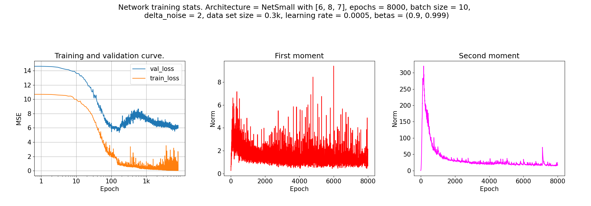

### Some results.

Increasing width of the network.

### Questions.

- Definition for (EMC) what is Error_S(M)? MSE?

- (**SOLVED**) Distribution for difference between predicted training values and actual values is too large?